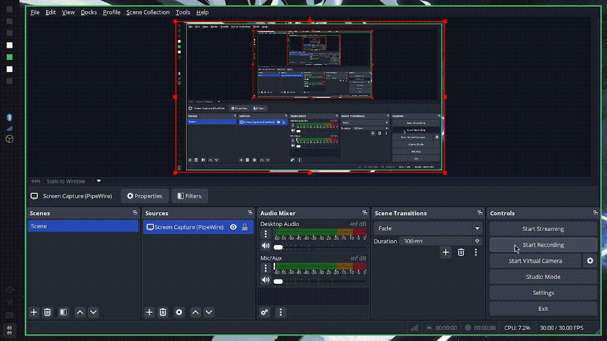

# Tsuki - ムーン
### Tsuki is a fast and simple theme switcher for linux


## Installation
#### Compiling from source
```sh
git clone https://github.com/arashi-software/tsuki
cd tsuki
nimble make # This will automatically build the package and install the binary to /usr/local/bin
```
If you want to install to a custom path you can install with
```sh
nimble build -d:release --verbose
sudo cp bin/tsuki <installation-location>
```

## Getting Started
Check out the wiki page for a full guide on how to get started with tsuki [here](https://github.com/arashi-software/tsuki/wiki/Getting-started)
